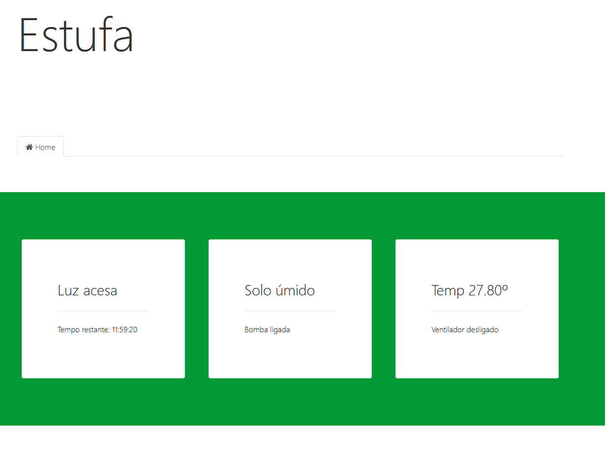
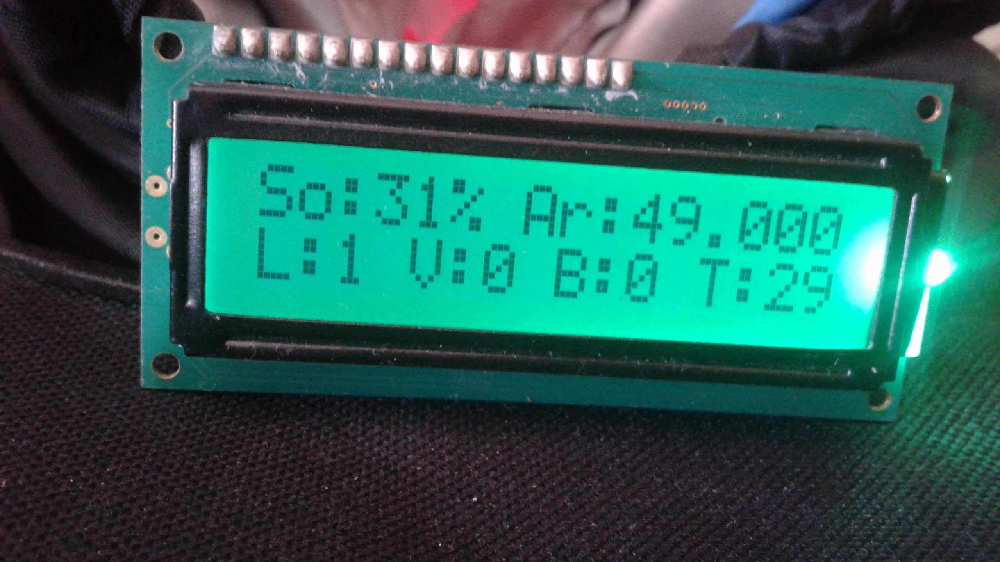
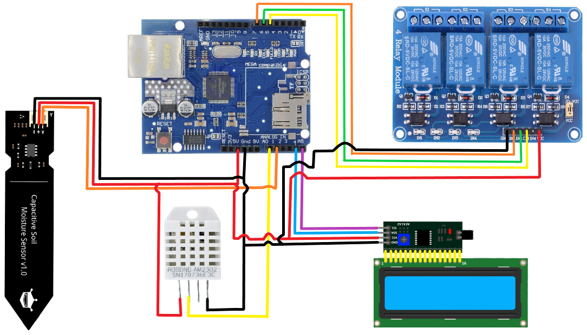

# Smart greenhouse
This project consists in an arduino board controlling an indoor envinroment for plants growth. There is a website where the user can monitoring the data.

## Website

## Components
- Arduino uno + Ethernet Shield
- LCD 16x2 + i2C module
- DHT22 temperature and humidity sensor
- HW-390 soil moisture sensor
- Relay module (3 channels)

## Schematics

## References
- [Pingendo](https://pingendo.com/)
- [Arduino's Ethernet library](https://www.arduino.cc/en/Reference/Ethernet)
- [Adafruit's DHT sensor library](https://github.com/adafruit/DHT-sensor-library)
- [Arduino's LiquidCrystal I2C library](https://www.arduino.cc/reference/en/libraries/liquidcrystal-i2c/)