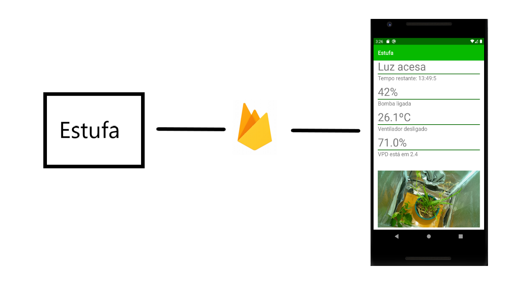

# Autonomous Greenhouse V2 [2019]
## How it works?
When turned on, the system will control the actuators (light, fan and pump), based on sensors values. All these informations can be visualized in realtime on your android mobile. 

## Components
- Raspberry pi 3B + picamera 
- Arduino UNO
- Relay module
- DHT22 sensor
- HW-390 capacitive soil moisture sensor
- Android mobile device

## Hardware schematics


## Architecture schematics


## How to set it up?
Discalimer: this firebase project is no long available. So you need to create your own Firebase projet and change the credentials in the code.

You must have a SO installed in your Raspberry (more info [here](https://www.raspberrypi.com/documentation/computers/getting-started.html#installing-the-operating-system)). [Here](https://www.raspberrypi.com/documentation/computers/configuration.html#menu-options) you can find information to enable the camera, SSH and VNC server.

After that, through a VNC client, connect to you raspi. With git installed, clone this repo in your Desktop folder and install arduino tools and upload the code to your arduino using ``make``. For example:

```
make install-arduino-tools
make upload board=arduino:avr:uno port=/dev/ttyUSB0 sketch=estufa/V2/arduino/arduino.ino
```

I recomend editing your ``/etc/rc.local`` file with the following commands to start everything at startup:
```
systemctl enable vncserver-x11-serviced.service
systemctl start vncserver-x11-serviced.service

sudo -H -u pi /usr/bin/python /home/pi/Desktop/V2/rasp.py
```

At least, you should install the .apk in your android.

## References
- [Pyrebase](https://github.com/thisbejim/Pyrebase)
- [Adafruit BME280 Library Build Status](https://github.com/adafruit/Adafruit_BME280_Library)