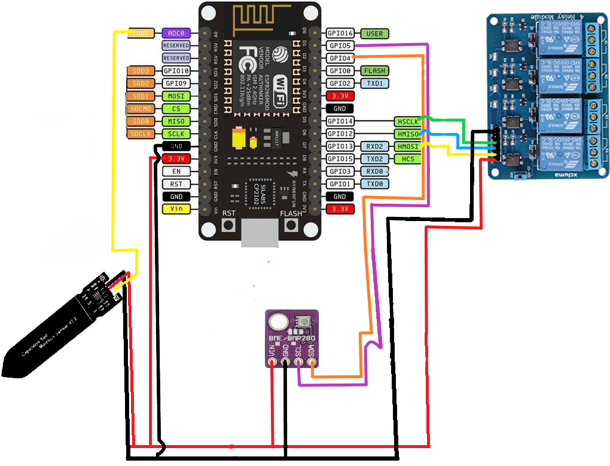

# Autonomous Greenhouse V3 [2021]
## Components
- NodeMCU (esp8266)
- Relay module
- BME280 sensor
- HW-390 capacitive soil moisture sensor
- Firebase project
- Android mobile device

## Hardware (Estufa) schematics


## Architecture schematics


## How to set it up?
Discalimer: this firebase project is no long available. So you need to create your own Firebase project and change the credentials in the code. Change Wi-Fi credentials too.

Discalimer 2: The esp.ino code may be uploaded to an esp8266 with the credentials variables modified. The app code can be found at [V2 repository](../V2/Estufa/app/).

After that, with git installed, clone this repo in your Desktop folder and install arduino tools and upload the code to your NodeMCU using ``make``. For example:

```
make install-arduino-tools
make upload board=esp8266:esp8266:esp8266 port=/dev/ttyUSB0 sketch=estufa/V3/esp/esp.ino
```

At least, you should install the [.apk](../V2/Estufa/app/build/outputs/apk/debug/app-debug.apk) in your android.

## References
- [Adafruit BME280 Library Build Status](https://github.com/mobizt/Firebase-ESP-Client)
- [Firebase Arduino Client Library for ESP8266 and ESP32](https://github.com/adafruit/Adafruit_BME280_Library)