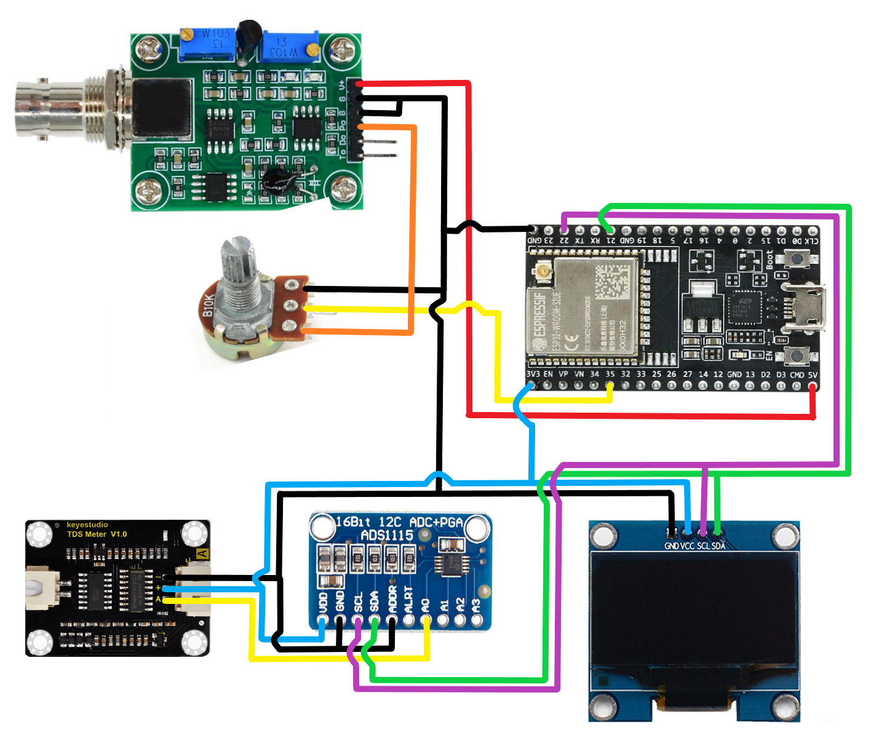

# Ph and TDS Meter for fertirrigation quality [2021]

This project is about measuring ph and TDS of plant watering solutions. 

## Components:
- Esp32
- 1.3" Oled display
- ph4502c sensor
- KS0429 keyestudio TDS Meter V1.0 sensor ( or DFRpbpt's Gravity Analog TDS Sensor)
- Adafruit ADS1115 16-Bit ADC 
- 10k potetiometer

## Schematics:

## References:
- [Arduino pH-meter using PH-4502C](https://cimpleo.com/blog/simple-arduino-ph-meter/)
- [GREENPONIK's DFRobot-based Library](https://github.com/greenponik/DFRobot_ESP_EC_BY_GREENPONIK)
- [U8g2: Library for monochrome displays, version 2](https://github.com/olikraus/u8g2)