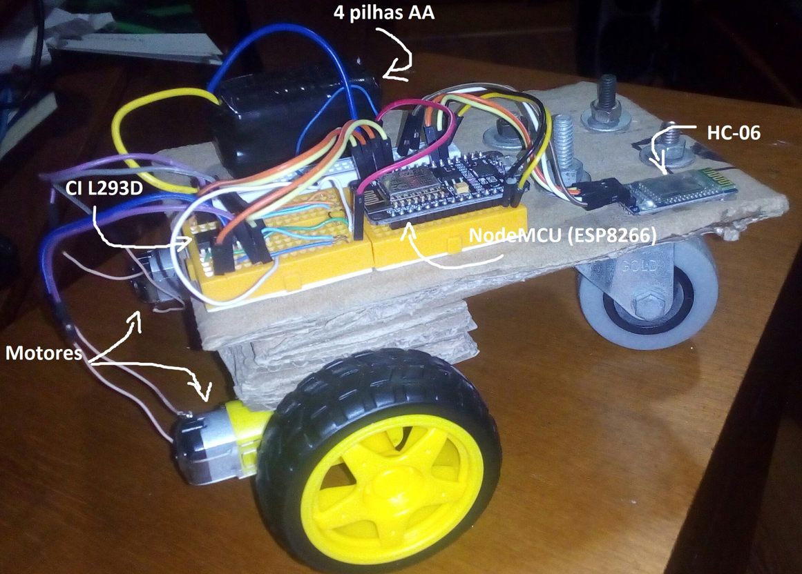
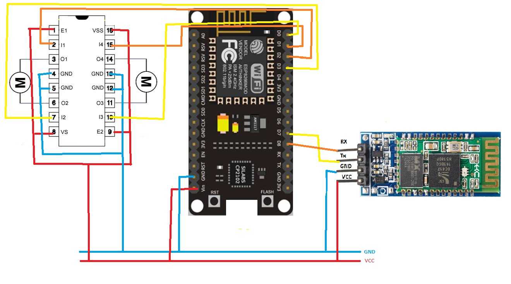
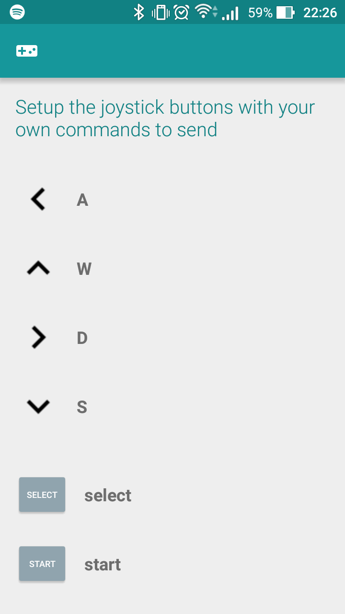

# Carrinho controlado por bluetooth, via aplicativo mobile [2018]
Material usado na construção do carrinho: 
- NodeMCU ESP8266
- Módulo bluetooth HC-06
- CI L293D
- 2 motores DC de 6V com redução conectados a 1 rodinha cada
- 1 rodinha giratória passiva
- 4 pilhas AA
- Jumpers
- Protoboards
- Fita adesiva dupla face 
- Plataforma improvisada com papelão e cola.
- Celular android 
- [App Arduino Bluetooth Controller](https://play.google.com/store/apps/details?id=com.giumig.apps.bluetoothserialmonitor&hl=pt_BR&gl=US)

## Montagem
A base possui formado retangular e um calço (feito com pedaços de papelão
empilhados e colados) na parte de trás para nivelar a altura das rodas traseiras com a
dianteira. A roda da frente foi presa com porcas e parafusos e as de trás com fita
adesiva dupla face, assim como todo o circuito. Vide foto abaixo:

## Esquemático

## Como funciona?
Os comandos são enviados pelo aplicativo ao módulo bluetooth HC-06. Este, por sua vez, envia-os ao microcontrolador ESP8266, que interpreta os comandos e controla os 2 motores, através do CI L293D.
Para o correto funcionamento, é necessário configurar o [app Arduino bluetooth controller](https://play.google.com/store/apps/details?id=com.giumig.apps.bluetoothserialmonitor&hl=pt_BR&gl=US). Seguem print para auxiliar:

